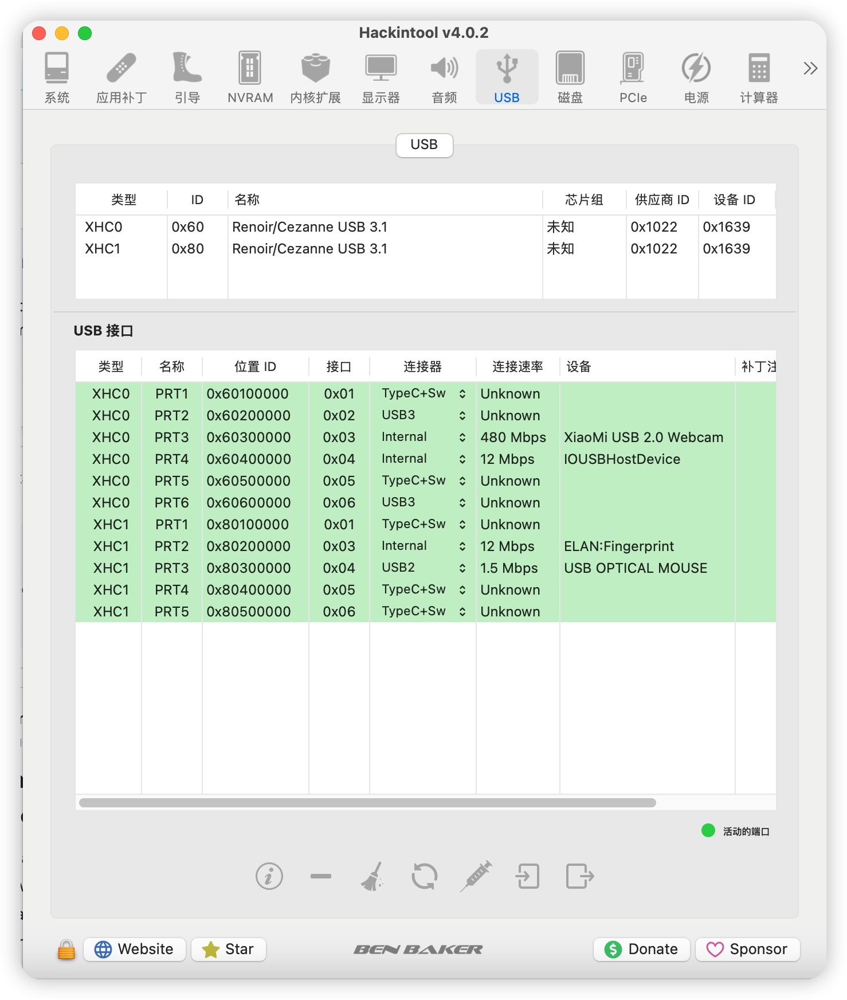
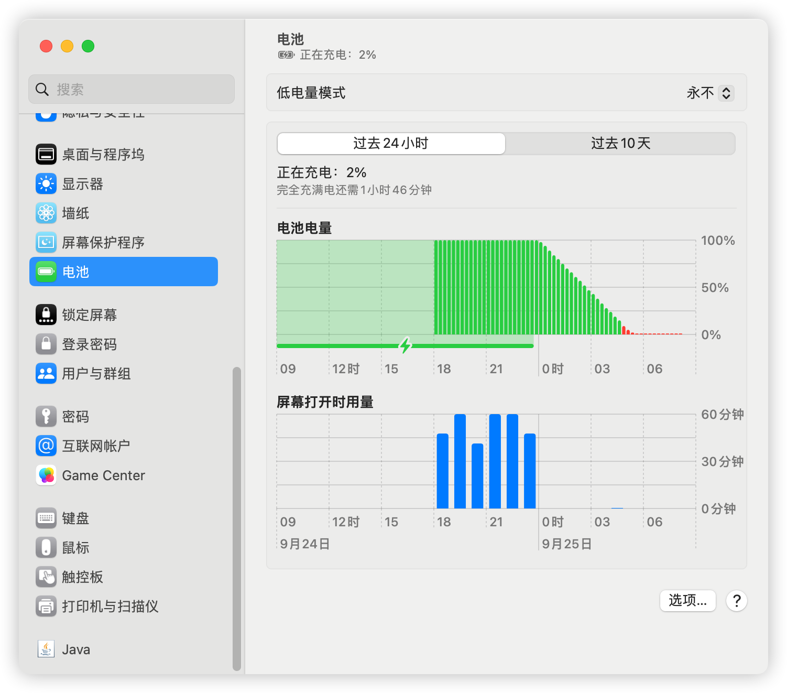

## Specifications

Type | Spec
:---------|:---------
Model Name | RedmiBook Pro 15S 2021
CPU | AMD Ryzen™ 5 5600H
RAM | 16 GB 3200 MHz DDR4
Wi-Fi | Intel® Wi-Fi 6 AX200
Audio | Realtek ALC256

## macOS Update History

- ✅ macOS Ventura 13.6

## What's working

Type | Status
:---------|:----------
CPU | ✅
AMD GPU Acceleration | ✅
CPU & GPU Power Management | ✅
Audio | ✅
Intel Wi-Fi | ✅
Battery Status | ✅
Shutdown / Reboot | ✅
Microphone | ✅
USB ALL | ✅

## What's partially working

Type | Info | Status
:---------|:---------|:----------
Deep sleep | Unable to achieve deep sleep, which results in shorter battery life | ⚠️
APU | When using some software that supports hardware acceleration, the system will replace the card and then recover, It is recommended to turn off hardware acceleration directly.   Then wait for the author to support the APU | ⚠️
Virtualization technology | Not supported.  If you have virtualization needs you can use a small computer with ARM architecture instead | ⚠️
> 

  
## usb

## battery

## Credits

- [Dortania](https://dortania.github.io) for their awesome guides.
- [Apple](https://www.apple.com) for macOS.
- [Acidanthera](https://github.com/acidanthera) for OpenCore and most Kexts.
- [**NootInc**](https://github.com/NootInc) for all the hard work to support AMD iGPU and trackpad.
- And anyone else that helped to develop and improve hackintoshing.
- [qhuyduong](https://github.com/qhuyduong)